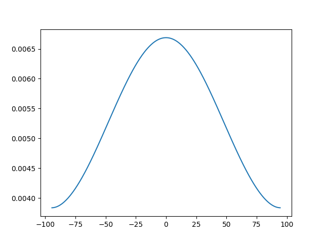

# SchroedingerEquation.jl

[](https://github.com/physarief78/SchroedingerEquation.jl/actions/workflows/CI.yml)
[](https://physarief78.github.io/SchroedingerEquation.jl/stable/)
[](https://opensource.org/licenses/MIT)

**SchroedingerEquation.jl** is a high-performance, production-grade Julia package for solving the 1D time-independent and time-dependent Schrödinger equation. It is designed for researchers who need numerical rigor, physical unit consistency, and high-performance scalability.

---

## 🌟 Key Features

- **🛡️ Rigorous Unit Handling**: Native integration with `Unitful.jl` and `UnitfulAtomic.jl`. Input parameters in `eV`, `nm`, `fs`, or `meV` with automatic conversion to internal atomic units.
- **⚡ High-Performance Solvers**:
  - **TISE**: $O(N)$ efficiency using specialized `SymTridiagonal` Hamiltonians and `KrylovKit`.
  - **TDSE (Unitary)**: Stable 2nd-order Crank-Nicolson propagation.
  - **TDSE (Spectral)**: Ultra-fast **Split-Step Fourier Method (SSFM)** for smooth potentials and periodic boundaries.
- **🌀 Advanced Boundary Conditions**:
  - **Manolopoulos CAP**: High-fidelity Complex Absorbing Potentials for zero-reflection scattering.
  - **Periodic & Hard-Wall**: Standard physical boundary support.
- **🧵 Parallel-Ready Architecture**: 
  - **Multi-threaded**: Built-in support for `Threads.@threads` via the **Workspace Pattern**.
  - **Distributed**: Seamless scaling to HPC clusters via `Distributed.jl`.
- **🎨 Visual Feedback**: Professional animations and live evolution tracking powered by `Makie.jl`.

---

## 🚀 Quick Start

### Installation
```julia
using Pkg
Pkg.add("SchroedingerEquation")
```

### Basic Example: Harmonic Oscillator
```julia
using SchroedingerEquation
using Unitful

# 1. Setup a unit-aware grid
basis = RealSpaceGrid1D(-10.0u"nm", 10.0u"nm", 1000)

# 2. Define a physical potential (Harmonic)
potential = HarmonicPotential(1.0u"eV/nm^2")

# 3. Build Hamiltonian & Solve TISE
ham = build_hamiltonian(basis, potential; hbar=1.0u"hbar", m=1.0u"me")
energies, wavefunctions = solve_tise(ham, 5)

println("Ground state energy: ", energies[1], " (Atomic Units)")
```

**Output:**
```console
Ground state energy: 1.8990771391438397e-10 (Atomic Units)
```

### High-Performance Parallel Sweep
```julia
using SchroedingerEquation
using Base.Threads

# Run 100 simulations in parallel with zero internal allocations
Threads.@threads for i in 1:100
    ws = SSFMWorkspace(psi_init, pot, dt)
    propagate_ssfm(psi_init, pot, t_total, dt; workspace=ws)
end
```

---

## 🐍 Python Integration

**SchroedingerEquation.jl** can be used seamlessly from Python via `juliacall`. This allows you to combine the performance of Julia's solvers with the ecosystem of Python (NumPy, Matplotlib, SciPy).

### Installation

1. Install the Python wrapper:
```bash
pip install .
```

### Python Example: TISE Solver
```python
import numpy as np
import schroedingerequation as se
import matplotlib.pyplot as plt

# 1. Setup grid and potential with physical units
basis = se.RealSpaceGrid1D(se.unit("-5.0u\"nm\""), se.unit("5.0u\"nm\""), 500)
pot = se.HarmonicPotential(se.unit("2.0u\"eV/nm^2\""))

# 2. Build Hamiltonian and solve
ham = se.build_hamiltonian(basis, pot)
energies, wavefunctions = se.solve_tise(ham, 3)

# 3. Use results in NumPy/Matplotlib
x = np.array(basis.x)
plt.plot(x, np.abs(wavefunctions[:, 0])**2)
plt.show()
```

**Output:**
```console
Ground state energy: 5.800139365314005e-05
```


---

## 📈 Performance comparison

| Method | Complexity | Best For |
| :--- | :--- | :--- |
| **Crank-Nicolson** | $O(N)$ | General potentials, non-periodic boundaries, high accuracy. |
| **SSFM (Spectral)** | $O(N \log N)$ | Smooth potentials, periodic systems, ultra-long simulations. |
| **SymTridiagonal TISE**| $O(N)$ | Finding eigenstates of static 1D Hamiltonians. |

---

## 📂 Project Structure

- `src/`: Core Julia implementation.
- `python/`: Python wrapper and `pyproject.toml`.
- `examples/`: Julia research examples.
- `examples/python_demo/`: 
    - `src/`: Python demo source code (`main.py`).
    - `results/`: Output plots and generated data.
- `test/`: Integrated Julia and Python test suites.

---

## 📖 Documentation
Detailed documentation, API references, and physics background are available at [https://physarief78.github.io/SchroedingerEquation.jl/](https://physarief78.github.io/SchroedingerEquation.jl/).

## 🤝 Contributing
Contributions are welcome! Whether it's adding 2D support, new solvers, or fixing bugs, please feel free to open a Pull Request.

## 📄 License
This project is licensed under the MIT License - see the [LICENSE](LICENSE) file for details.