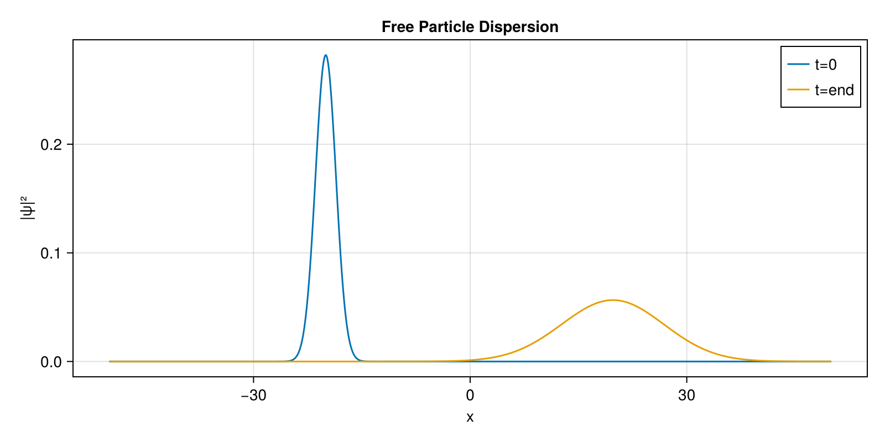

# 1. Free Space Dispersion

This first example demonstrates the absolute basics: how to set up a spatial grid, initialize a Gaussian wavepacket, and propagate it in free space (where the potential $V = 0$) using the Time-Dependent Schrödinger Equation (TDSE).

### Step 1: Initialization
We begin by importing the necessary packages. `SchroedingerEquation` handles the physics, `LinearAlgebra` provides utility for normalization, and `CairoMakie` is used for high-quality static plotting.

```julia
using SchroedingerEquation
using LinearAlgebra
using CairoMakie

# ==========================================
# 01. Setup the Spatial Grid
# ==========================================
# We define a 1D grid spanning from -50.0 to 50.0 with 1000 discrete points.
basis = RealSpaceGrid1D(-50.0, 50.0, 1000)
```

### Step 2: Defining the Physics
Next, we define the environment. Since this is free space, the potential energy is zero everywhere.

```julia
# ==========================================
# 02. Build the Hamiltonian
# ==========================================
# Free particle (V = 0)
potential = CustomPotential(x -> 0.0)
ham = build_hamiltonian(basis, potential)
```

### Step 3: Preparing the Initial State
We construct a Gaussian wavepacket representing our particle. We give it an initial momentum `p0 = 2.0` so that it travels to the right.

```julia
# ==========================================
# 03. Create Initial Wavepacket
# ==========================================
x0 = -20.0
sigma = 2.0
p0 = 2.0
psi0_vals = [exp(-(x - x0)^2 / (2 * sigma^2)) * exp(im * p0 * x) for x in basis.x]
psi0 = Wavefunction1D(ComplexF64.(psi0_vals), basis)
normalize!(psi0)
```

### Step 4: Time Propagation & Visualization
Finally, we evolve the system forward in time. The `propagate_tdse` function returns a history array containing the wavefunction at each saved time step.

```julia
# ==========================================
# 04. Time Evolution
# ==========================================
t_total = 20.0
dt = 0.02
history = propagate_tdse(psi0, ham, t_total, dt; save_stride=20)

# ==========================================
# 05. Visualize
# ==========================================
fig = Figure(size=(800, 400))
ax = Axis(fig[1,1], title="Free Particle Dispersion", xlabel="x", ylabel="|ψ|²")
lines!(ax, basis.x, abs2.(history[1].psi), label="t=0")
lines!(ax, basis.x, abs2.(history[end].psi), label="t=end")
axislegend(ax)

save("examples/results/01_free_space.png", fig)
println("Saved results to examples/results/01_free_space.png")
```

**Console Output:**
```text
Saved results to examples/results/01_free_space.png
```

**Resulting Plot:**



As expected, the wavepacket travels to the right and its width increases (disperses) over time according to the fundamental principles of quantum mechanics!
