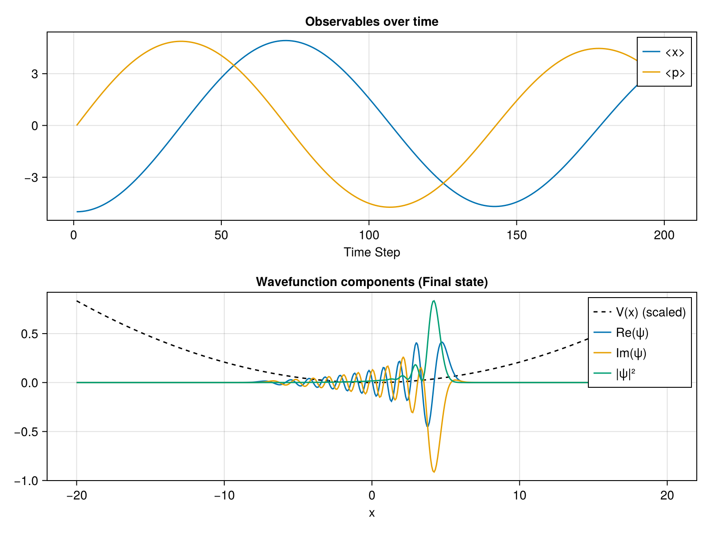

# 2. Phase and Observables

In this tutorial, we will explore how to track quantum observables (like position $\langle x \rangle$ and momentum $\langle p \rangle$) over time while a wavepacket evolves in a potential trap.

### Setup and Initialization
We set up a harmonic potential $V(x) = \frac{1}{2} k x^2$ and initialize our wavepacket as a coherent state (a Gaussian displaced from the center). 

```julia
using SchroedingerEquation
using LinearAlgebra
using CairoMakie

# Setup
basis = RealSpaceGrid1D(-20.0, 20.0, 500)
potential = HarmonicPotential(1.0)
ham = build_hamiltonian(basis, potential)

# Initial state (coherent state/displaced gaussian)
psi0_vals = exp.(-(basis.x .+ 5.0).^2 ./ 2.0)
psi0 = Wavefunction1D(ComplexF64.(psi0_vals), basis)
normalize!(psi0)
```

### Tracking Observables
The `propagate_tdse` function accepts an optional `observables` named tuple. We define functions that compute the expectation values. For momentum, we use the `build_momentum_operator` utility.

```julia
# Track position and momentum
obs = (x = wf -> expectation_value(wf, x -> x), 
       p = wf -> expectation_value(wf, build_momentum_operator(basis)))

t_total = 10.0
dt = 0.05
history, obs_data = propagate_tdse(psi0, ham, t_total, dt; observables=obs)
```

### Visualization
Finally, we plot the oscillating position and momentum, demonstrating the classic harmonic oscillator behavior! We also plot the final wavefunction components.

```julia
# Visualization
fig = Figure(size=(800, 600))
ax1 = Axis(fig[1, 1], title="Observables over time", xlabel="Time Step")
lines!(ax1, float.(obs_data.x), label="<x>")
lines!(ax1, real.(obs_data.p), label="<p>")
axislegend(ax1)

ax2 = Axis(fig[2, 1], title="Wavefunction components (Final state)", xlabel="x")
wf_final = history[end]
# Normalize potential for plotting
V_vals = [ham.potential(xi) for xi in basis.x]
V_plot = real.(V_vals) ./ maximum(abs.(V_vals)) .* maximum(abs2.(wf_final.psi))
lines!(ax2, basis.x, V_plot, color=:black, linestyle=:dash, label="V(x) (scaled)")
lines!(ax2, basis.x, real.(wf_final.psi), label="Re(ψ)")
lines!(ax2, basis.x, real.(imag.(wf_final.psi)), label="Im(ψ)")
lines!(ax2, basis.x, real.(abs2.(wf_final.psi)), label="|ψ|²")
axislegend(ax2)

save("examples/results/02_observables.png", fig)
println("Saved results to examples/results/02_observables.png")
```

**Console Output:**
```text
Saved results to examples/results/02_observables.png
```

**Resulting Plot:**


