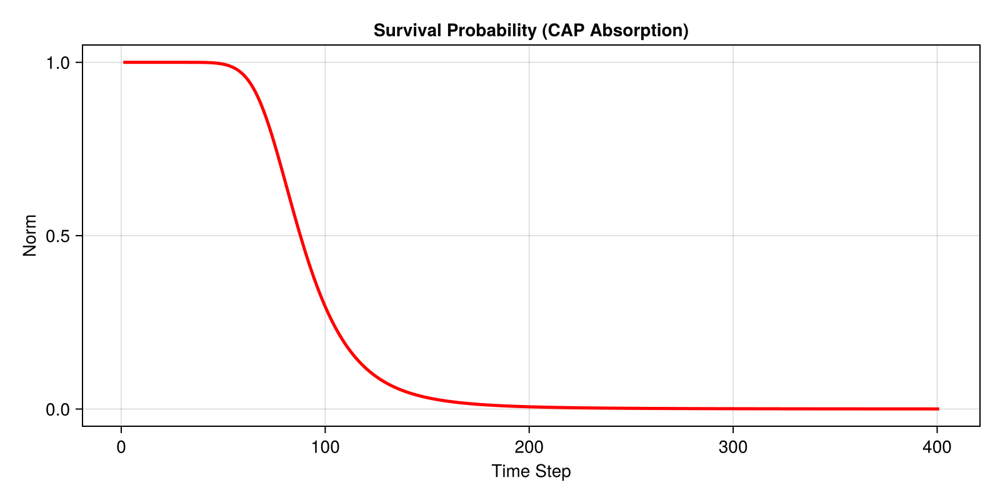

# Absorbing Boundaries

In open quantum systems, particles can escape the simulated region. Simulating this requires special boundary conditions that absorb the wavepacket without reflecting it back. In this tutorial, we use a Complex Absorbing Potential (CAP).

### Setup
We use an `AbsorbingBoundary` which implements the Manolopoulos CAP, designed specifically for minimizing reflections.

```julia
using SchroedingerEquation
using LinearAlgebra
using CairoMakie

# Setup
basis = RealSpaceGrid1D(-20.0, 20.0, 1000) # Higher resolution for smoother CAP
# Use a slightly larger and stronger CAP for "0% reflections"
cap = AbsorbingBoundary(8.0, 2.0)
ham = build_hamiltonian(basis, CustomPotential(x -> 0.0), cap)
```

### Initial State
We start the wavepacket close to the center and give it momentum towards the left boundary.

```julia
# Wavepacket
x0 = -5.0         # Start closer to center to give it space
p0 = 3.0          # Momentum
direction = -1.0  # Moving to the left towards the CAP

psi0_vals = exp.(-(basis.x .- x0).^2 ./ 2.0) .* exp.(im * p0 * direction .* basis.x)
psi0 = Wavefunction1D(ComplexF64.(psi0_vals), basis)
normalize!(psi0)
```

### Tracking Survival Probability
Because the boundary absorbs the wave, the total norm of the wavefunction will decrease over time. We track this using the `observables` feature.

```julia
# Track norm
obs = (norm = wf -> sum(abs2, wf.psi) * wf.basis.dx,)
history, obs_data = propagate_tdse(psi0, ham, 20.0, 0.05; observables=obs)

# Visualization
fig = Figure(size=(800, 400))
ax = Axis(fig[1, 1], title="Survival Probability (CAP Absorption)", xlabel="Time Step", ylabel="Norm")
lines!(ax, obs_data.norm, color=:red, linewidth=2.5)
save("examples/results/04_absorbing_boundaries.png", fig)

# Animate without passing the boundary object as a potential
animate_evolution(history; filename="examples/results/04_absorbing.mp4", fps=30, title="Absorption Dynamics")
println("Saved results to examples/results/04_absorbing_boundaries.png and .mp4")
```

**Console Output:**
```text
Saved results to examples/results/04_absorbing_boundaries.png and .mp4
```

**Resulting Plot:**



**Animation:**


