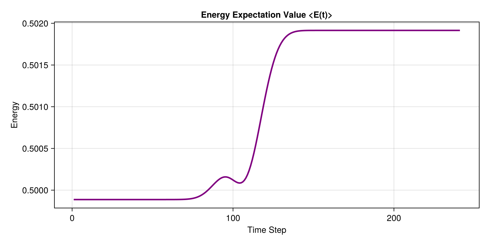

# 5. Ultrafast Excitation

Simulating time-dependent potentials (like a laser pulse hitting an electron in a trap) is a core capability of `SchroedingerEquation.jl`.

In this tutorial, we place an electron in the ground state of a harmonic oscillator and then strike it with an ultrashort, oscillating laser pulse.

### Defining the Time-Dependent Potential
We use `CustomTimeDependentPotential`, which accepts a function of both position `x` and time `t`. Here, we model a Gaussian-enveloped laser pulse $V(x, t) = -x \cdot E(t) \cdot \cos(\omega t)$.

```julia
using SchroedingerEquation
using LinearAlgebra
using SparseArrays
using CairoMakie

# Setup
basis = RealSpaceGrid1D(-30.0, 30.0, 1000)
static_pot = HarmonicPotential(1.0)
boundary = AbsorbingBoundary(5.0)

# Laser pulse: enveloped oscillating field
pulse = CustomTimeDependentPotential((x, t) -> -x * 0.1 * exp(-((t - 5.0)/1.0)^2) * cos(1.0 * t))
```

### Initializing the Ground State
To calculate the initial state, we build the static Hamiltonian (without the laser) and solve the Time-Independent Schrödinger Equation (TISE) for the ground state.

```julia
# Ground state
ham_static = build_hamiltonian(basis, static_pot, boundary)
energies, wavefunctions = solve_tise(ham_static, 1)
psi0 = wavefunctions[1]
```

### Dynamic Propagation
We pass the static `ham_static.H_matrix` and the time-dependent `pulse` to `propagate_tdse`. The solver is smart enough to efficiently add the time-dependent components to the diagonal of the matrix at each time step. We also track the Energy expectation value.

```julia
# Dynamic propagation
t_total = 12.0
dt = 0.05

# Track normalized energy expectation value
obs = (E = wf -> real(expectation_value(wf, ham_static.H_matrix)) / (sum(abs2, wf.psi) * wf.basis.dx),)
history, obs_data = propagate_tdse(psi0, basis, ham_static.H_matrix, pulse, t_total, dt; observables=obs)

# Visualization
fig = Figure(size=(800, 400))
ax = Axis(fig[1, 1], title="Energy Expectation Value <E(t)>", xlabel="Time Step", ylabel="Energy")
lines!(ax, real.(obs_data.E), color=:purple, linewidth=2.5)

save("examples/results/05_excitation.png", fig)
println("Saved results to examples/results/05_excitation.png")
```

**Console Output:**
```text
Saved results to examples/results/05_excitation.png
```

**Resulting Plot:**



Notice how the energy spikes precisely when the laser pulse peaks at $t = 5.0$, meaning the electron has been successfully excited into higher energy states!
