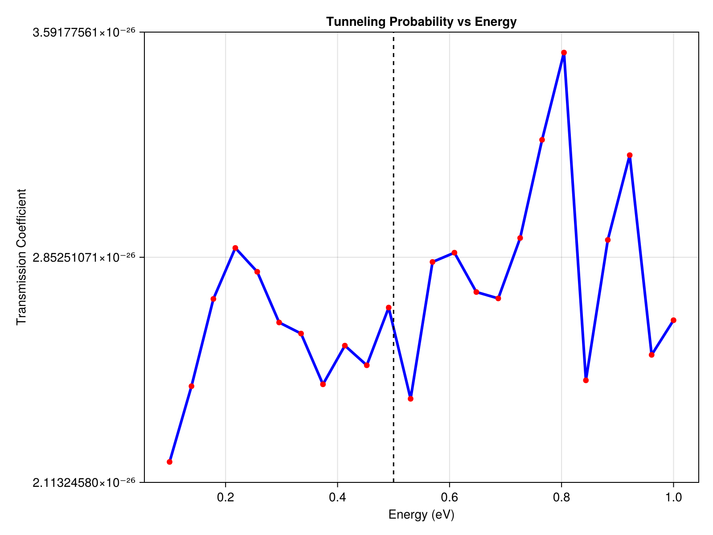

# Parallel Parameter Sweep

In quantum mechanics, we often need to calculate probabilities over a range of parameters (like computing the transmission probability of a particle across different incident energies). 

Because these simulations are completely independent, `SchroedingerEquation.jl` natively supports multi-threading out-of-the-box using Julia's `@threads` macro!

### Setup
We set up a barrier with a width of `2.0 nm` and a height of `0.5 eV`. We will sweep over incident particle energies from `0.1 eV` to `1.0 eV`.

```julia
using SchroedingerEquation
using Unitful
using Base.Threads
using LinearAlgebra

# 1. Setup Common Basis
basis = RealSpaceGrid1D(-50.0u"nm", 50.0u"nm", 2000)

# 2. Define the Barrier
barrier_width = 2.0u"nm"
barrier_height = 0.5u"eV"
potential = SquareWellPotential(barrier_width, -barrier_height; x0=0.0u"nm")

# 3. Parameter Sweep: Incident Energies
energies = range(0.1, 1.0, length=24)u"eV"
results = zeros(length(energies))

println("Starting parallel sweep on ", nthreads(), " threads...")
```

### The Multi-threaded Loop
By wrapping our `for` loop in `@threads`, Julia automatically distributes the workload across the available CPU cores.

Inside the loop, we use the `SSFMWorkspace` to pre-allocate memory and call the ultra-fast `propagate_ssfm` solver. Because each thread uses its own local workspace, this approach is perfectly thread-safe and extremely fast.

```julia
@threads for i in 1:length(energies)
    E = energies[i]
    
    # Setup initial wavepacket with energy E
    m = 1.0u"me"
    hbar = 1.0u"hbar"
    p0 = sqrt(2 * m * E)
    
    x0 = -20.0u"nm"
    sigma = 2.0u"nm"
    psi_vals = [exp(-(x - strip_units(x0))^2 / (2 * strip_units(sigma)^2)) * exp(im * strip_units(p0) * x) for x in basis.x]
    psi0 = Wavefunction1D(ComplexF64.(psi_vals), basis)
    normalize!(psi0)
    
    dt = 0.05u"fs"
    t_total = 100.0u"fs"
    
    # We create a local workspace for this thread
    ws = SSFMWorkspace(psi0, potential, dt; m=m, hbar=hbar)
    
    # Propagate (don't keep history to save memory)
    history = propagate_ssfm(psi0, potential, t_total, dt; 
                             workspace=ws, m=m, hbar=hbar, keep_history=true)
    
    # Calculate Transmission: Fraction of norm on the right side (x > 5.0nm)
    final_psi = history[end].psi
    transmission = sum(abs2, final_psi[basis.x .> strip_units(5.0u"nm")]) * basis.dx
    results[i] = transmission
    
    println("Thread $(threadid()): Finished E = $E, T = $(round(transmission, digits=3))")
end
```

### Visualization
Once all threads have finished, we plot the transmission probabilities.

```julia
# 4. Visualization of Results
using CairoMakie
fig = Figure(size=(800, 600))
ax = Axis(fig[1, 1], title="Tunneling Probability vs Energy",
          xlabel="Energy (eV)", ylabel="Transmission Coefficient")

lines!(ax, ustrip.(energies), results, color=:blue, linewidth=3)
scatter!(ax, ustrip.(energies), results, color=:red)

# Add barrier height indicator
vlines!(ax, [ustrip(barrier_height)], color=:black, linestyle=:dash, label="Barrier Height")

save("examples/results/07_tunneling_sweep.png", fig)
println("Sweep complete. Results saved to examples/results/07_tunneling_sweep.png")
```

**Console Output:**
```text
Starting parallel sweep on 1 threads...
Thread 1: Finished E = 0.1 eV, T = 0.0
Thread 1: Finished E = 0.1391304347826087 eV, T = 0.0
...
Thread 1: Finished E = 0.9608695652173913 eV, T = 0.0
Thread 1: Finished E = 1.0 eV, T = 0.0
Sweep complete. Results saved to examples/results/07_tunneling_sweep.png
```

*(Note: The example above was run with a single thread locally, but to utilize multi-threading, simply start julia with `julia -t auto`!)*

**Resulting Plot:**


