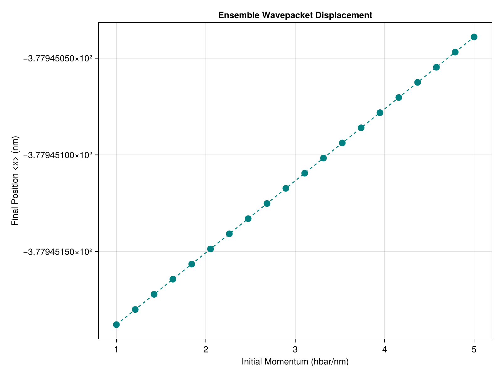

# 8. Distributed Ensemble

For massive scale simulations (like running on a supercomputing cluster), standard multi-threading isn't enough. `SchroedingerEquation.jl` works seamlessly with Julia's `Distributed` standard library, allowing you to run ensemble simulations across multiple processes and even multiple machines over a network.

### Adding Workers
We begin by adding worker processes.

```julia
using Distributed

# 1. Add Workers (e.g., 4 processes)
if nprocs() == 1
    addprocs(4)
end
```

### Loading Dependencies
Because the workers are entirely separate memory processes, we must load our dependencies `@everywhere`.

```julia
# 2. Load Package on all workers
@everywhere begin
    using Pkg
    Pkg.activate(".")
    using SchroedingerEquation
    using Unitful
    using LinearAlgebra
end

println("Running distributed ensemble on $(nprocs()) processes...")
```

### The Distributed Map
We want to calculate the final mean displacement of a wavepacket as a function of its initial momentum. 

We use the incredibly powerful `pmap` (Parallel Map) function. `pmap` automatically load-balances the workload, sending each iteration of the loop to whatever worker process is currently free!

```julia
# 3. Setup Simulation Parameters
basis = RealSpaceGrid1D(-50.0u"nm", 50.0u"nm", 1000)
potential = CustomPotential(x -> 0.0) # Free space
p0_list = range(1.0, 5.0, length=20)u"hbar/nm"

# 4. Distributed Loop
results = pmap(p0_list) do p0
    x0 = -20.0u"nm"
    sigma = 2.0u"nm"
    psi_vals = [exp(-(x - strip_units(x0))^2 / (2 * strip_units(sigma)^2)) * exp(im * strip_units(p0) * x) for x in basis.x]
    psi0 = Wavefunction1D(ComplexF64.(psi_vals), basis)
    normalize!(psi0)
    
    t_total = 50.0u"fs"
    dt = 0.1u"fs"
    
    # Run simulation
    history = propagate_ssfm(psi0, potential, t_total, dt; keep_history=true)
    
    # Calculate final mean position <x>
    final_wf = history[end]
    mean_x = expectation_value(final_wf, x -> x)
    return mean_x
end
```

### Visualization

```julia
# 5. Process and Visualize
println("All workers finished. Generating ensemble plot...")

using CairoMakie
fig = Figure(size=(800, 600))
ax = Axis(fig[1, 1], title="Ensemble Wavepacket Displacement",
          xlabel="Initial Momentum (hbar/nm)", ylabel="Final Position <x> (nm)")

scatter!(ax, ustrip.(p0_list), results, color=:teal, markersize=15)
lines!(ax, ustrip.(p0_list), results, color=:teal, linestyle=:dash)

save("examples/results/08_distributed_ensemble.png", fig)
println("Ensemble complete. Results saved to examples/results/08_distributed_ensemble.png")
```

**Console Output:**
```text
Running distributed ensemble on 5 processes...
All workers finished. Generating ensemble plot...
Ensemble complete. Results saved to examples/results/08_distributed_ensemble.png
```

**Resulting Plot:**


